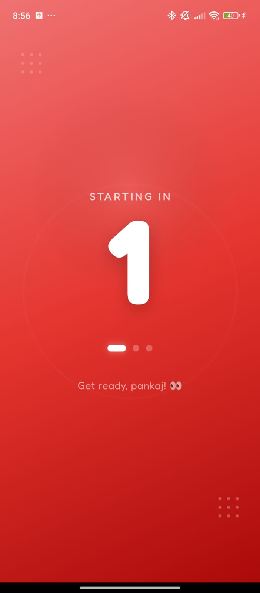
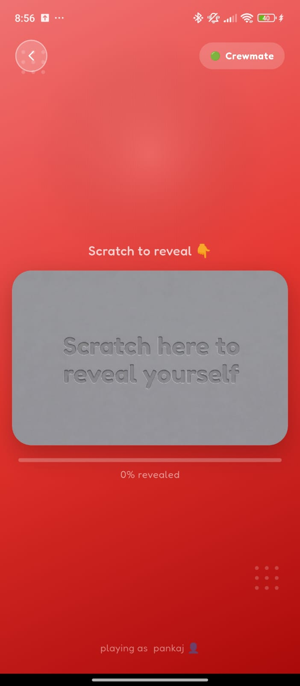
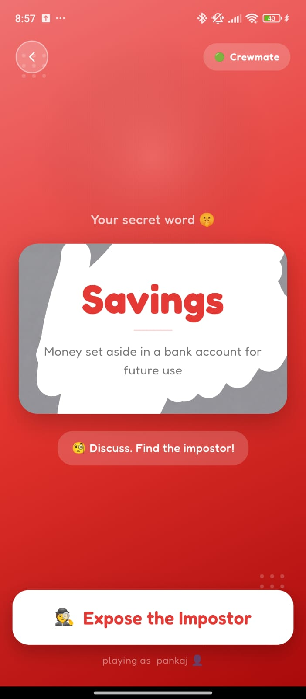
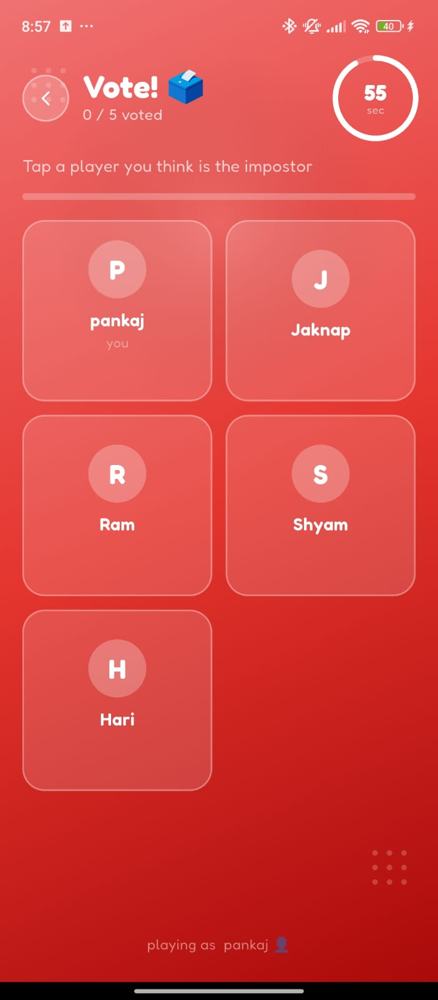
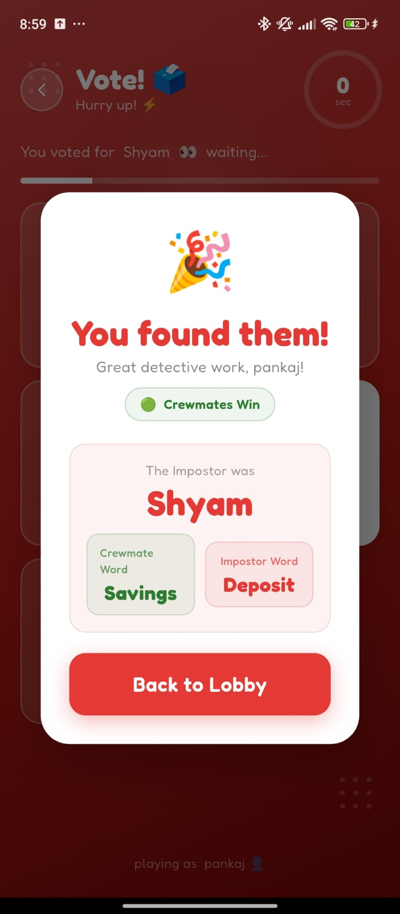

# 🕵️ Impostor — Lie. Blend in. Survive.

> A real-time multiplayer social deduction game built with Flutter & Firebase.  
> Get a secret word, talk around it, and find the one player who got a *different* word.

<br/>

## 📸 Screenshots

| Lobby | Room | Countdown | Name Entry |
|-------|------|-----------|------------|
|  |  |  |  |

| Scratch Reveal | Secret Word | Voting | Results |
|----------------|-------------|--------|---------|
|  |  |  |  |

<br/>

## 🎮 How to Play

1. **Create or Join a Room** — One player creates a room and shares the 6-character room code with friends.
2. **Pick Your Name** — Each player joins and picks a display name (max 10 characters).
3. **Scratch to Reveal** — After the game starts, scratch the card on your own phone to see your secret word.
4. **Discuss** — Everyone knows the same word — *except the Impostor*, who gets a similar but different word.
5. **Vote** — Tap the player you think is the Impostor before the timer runs out.
6. **Reveal** — The most-voted player is exposed. Did the Crewmates find the Impostor, or did they slip through?

> Minimum **4 players** required. Supports up to **10 players** per room.

<br/>

## ✨ Features

- 🏠 **Room System** — Create and join rooms with a unique 6-character code
- 👥 **Multiplayer Support** — Up to 10 players per room with live player list
- ⚡ **Real-Time Updates** — Firebase Realtime Database keeps all players in sync instantly
- 🎴 **Scratch-to-Reveal** — Interactive scratch card animation to privately reveal your role and word
- 🗳️ **Live Voting System** — Timed voting round with live vote counts visible to all players
- 🏆 **Result Screen** — Reveals the Impostor, their word vs the Crewmate word, and who won
- 🎨 **Polished UI** — Smooth animations, red-themed design, and responsive layout throughout

<br/>

## 🛠️ Tech Stack

| Layer | Technology |
|-------|-----------|
| **Framework** | Flutter 3.35.5 (Dart 3.9.2) |
| **State Management** | BLoC / Clean Architecture |
| **Realtime Backend** | Firebase Realtime Database |
| **Authentication** | Anonymous / Name-based session |
| **Platform** | Android (Play Store) |

<br/>

## 🚀 Getting Started

### Prerequisites

- Flutter SDK `>=3.0.0`
- Dart `>=3.0.0`
- Firebase project with Realtime Database enabled
- [FVM](https://fvm.app/) (optional, recommended)

### Setup

```bash
# Clone the repo
git clone https://github.com/Pankaj09997/impostorgame.git
cd impostorgame

# Install dependencies
flutter pub get

# Run the app
flutter run
```

### Firebase Configuration

1. Create a project at [Firebase Console](https://console.firebase.google.com/)
2. Enable **Realtime Database**
3. Download `google-services.json` (Android) and place it in `android/app/`
4. Update Firebase rules to allow read/write during development:

```json
{
  "rules": {
    ".read": true,
    ".write": true
  }
}
```

> ⚠️ Tighten rules before production deployment.

<br/>

## 📁 Project Structure

```
lib/
├── core/               # App-wide constants, theme, utilities
├── data/               # Firebase data sources & repositories
├── domain/             # Entities, use cases, repository contracts
├── presentation/
│   ├── lobby/          # Lobby screen (create/join room)
│   ├── chamber/        # Waiting room / player list
│   ├── game/           # Scratch reveal, secret word screen
│   ├── vote/           # Voting screen with timer
│   └── result/         # Game result screen
└── main.dart
```

<br/>

## 📦 Version History

### v1.0.0 — First Full Release 🎉

**Features**
- Complete multiplayer gameplay with up to 10 players per room
- Real-time voting system for impostor detection
- Animated result reveal screen
- Room creation and management
- Fully functional lobby with player name selection
- Firebase integration for real-time updates
- Smooth and responsive UI throughout the app

**Bug Fixes**
- Fixed crash when room reaches max players
- Name duplication checks implemented
- Fixed minor UI glitches during gameplay

**Improvements**
- Optimized network calls for better performance
- Minor UX improvements in lobby and game screens

<br/>

## 🤝 Contributing

Contributions, issues, and feature requests are welcome!  
Feel free to open an issue or submit a pull request.

1. Fork the repo
2. Create your feature branch: `git checkout -b feature/your-feature`
3. Commit your changes: `git commit -m 'Add your feature'`
4. Push to the branch: `git push origin feature/your-feature`
5. Open a pull request

<br/>

## 👤 Author

**Pankaj Pandey**  
- 🌐 [pankajpandey.com.np](https://pankajpandey.com.np)  
- 💼 [LinkedIn](https://linkedin.com/in/pankaj-pandey)  
- 🐙 [GitHub @Pankaj09997](https://github.com/Pankaj09997)  
- 📧 pankajpandey.p18@gmail.com

<br/>

## 📄 License

This project is licensed under the MIT License — see the [LICENSE](LICENSE) file for details.

---

<p align="center">Made with ❤️ and Flutter in Nepal 🇳🇵</p>
